BIOL4408 Marine Ecology: Lobster density 4.
================
TimLanglois
09/01/2020

# 4\. Advanced plots

For a discussion the Do’s and don’ts of making effective graphics, I
recomend checking out Jenny Bryan’s recomnedations in her excellent
course: <https://stat545.com/effective-graphs.html>

Rember that generally you should only plot by significant/important
factors/relationships. So plots presented in your Results section should
reflect what you find to be significant/important in your data analysis.

Below are exmaples of how to plot potentially significant/important
factors.

Load extra librarys

``` r
library(tidyr) #to tidy data
library(dplyr) #to transform data
library(readr) #to write data
library(here) #to make robust links to files

library(forcats) #to transform catagorical data
library(ggplot2) #to plot data
```

Set a study name

``` r
study<-"lobster.density"
```

Create functions to plotting SE

``` r
se <- function(x) sd(x) / sqrt(length(x))
se.min <- function(x) (mean(x)) - se(x) #to make SE min.
se.max <- function(x) (mean(x)) + se(x) #to make SE max.
```

Use here() to make a shortcut to the “Data” directory.

``` r
data.dir <- here("Data")

# or for ecocloud
#data.dir <- here("workspace","Template-lobster-density","Data")
```

Create a ‘Plots’ folder if you don’t already have one and create a
shortcut to it

``` r
dir.create(file.path(here(), "Plots")) #create Plots folder

plots.dir=here("Plots")

# or for ecocloud
#dir.create(file.path(here(), "workspace","Template-lobster-density","Plots"))
#plots.dir <- here("workspace","Template-lobster-density","Plots")
```

Read in data for plotting

``` r
data.dir <- here("Data")
setwd(data.dir)#this is out shortcut using here()
dir()
```

    ## [1] "lobster.density.csv"        "lobster.density.gsheet.csv"

``` r
dat<-read_csv("lobster.density.csv")%>%
  glimpse()
```

    ## Parsed with column specification:
    ## cols(
    ##   sample.no = col_double(),
    ##   year = col_double(),
    ##   date = col_datetime(format = ""),
    ##   sanctuary = col_character(),
    ##   status = col_character(),
    ##   site.new = col_character(),
    ##   complexity = col_double(),
    ##   depth = col_double(),
    ##   size.class = col_character(),
    ##   count = col_double()
    ## )

    ## Observations: 7,032
    ## Variables: 10
    ## $ sample.no  <dbl> 1, 2, 3, 4, 5, 6, 7, 8, 9, 10, 11, 12, 13, 14, 15, 16, 17,…
    ## $ year       <dbl> 2014, 2014, 2014, 2014, 2014, 2014, 2014, 2014, 2014, 2014…
    ## $ date       <dttm> 2014-01-26 16:00:00, 2014-01-26 16:00:00, 2014-01-26 16:0…
    ## $ sanctuary  <chr> "Armstrong Bay", "Armstrong Bay", "Armstrong Bay", "Armstr…
    ## $ status     <chr> "No-take", "No-take", "No-take", "No-take", "No-take", "No…
    ## $ site.new   <chr> "Armstrong Bay.No-take.Little Armstrong", "Armstrong Bay.N…
    ## $ complexity <dbl> 0, 2, 4, 1, 4, 2, 2, 2, 2, 1, 3, 1, 1, 2, 1, 3, 1, 2, 2, 0…
    ## $ depth      <dbl> 0, 0, 0, 0, 0, 0, 0, 0, 0, 0, 0, 0, 0, 0, 0, 0, 0, 0, 0, 0…
    ## $ size.class <chr> "legal", "legal", "legal", "legal", "legal", "legal", "leg…
    ## $ count      <dbl> 0, 0, 0, 0, 0, 0, 0, 0, 0, 0, 0, 0, 1, 0, 0, 0, 0, 0, 0, 0…

## Make mean and SE plot

Make a mean +/-SE plot with a title. Here we use stat\_summary() and the
functions we made
above.

``` r
ggplot(dat%>%filter(size.class=="legal"), aes(x=status, y=count,fill=status)) + 
  stat_summary(fun.y=mean, geom="bar") + #add bar at mean
  stat_summary(fun.ymin = se.min, fun.ymax = se.max, geom = "errorbar", width = 0.1) #add error bars
```

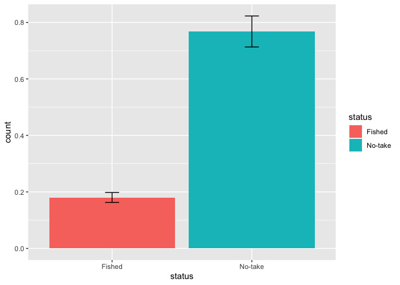<!-- -->

## Save a plot

Here we use ggsave(), you can specify the format of the plot, it’s size
and many other settings. By default it will use the last plot made and
set the size of the plot to the size of the plotting window.

``` r
ggsave(here("Plots","status.barplot.png"))
```

    ## Saving 7 x 5 in image

When you make a plot you can create a plot object and then call this in
the ggsave() - we have also added a
title

``` r
status.barplot <- ggplot(dat%>%filter(size.class=="legal"), aes(x=status, y=count,fill=status)) + 
  stat_summary(fun.y=mean, geom="bar") + #add bar at mean
  stat_summary(fun.ymin = se.min, fun.ymax = se.max, geom = "errorbar", width = 0.1) + #add error bars
  ggtitle("Legal lobster") #add a title
status.barplot
```

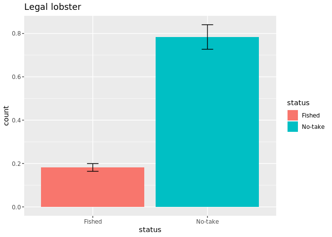<!-- -->

Here we save the plot base on its name. This makes life simpler when you
are making mulitple plots in a script and want to save them all in one
go at the end of the script. We can also sett the size of the final plot

``` r
ggsave(here("Plots","status.barplot2.png"),status.barplot)
```

    ## Saving 7 x 5 in image

``` r
ggsave(here("Plots","status.barplot2.png"),status.barplot,
       width = 15, height = 8,units = "cm") 
```

## What’s wrong with this code?

ggbarplot.status.size\<-ggplot(dat, aes(x=status, y=count,fill=status))
+ stat\_summary(fun.y=mean, geom=“bar”) + stat\_summary(fun.ymin =
se.min, fun.ymax = se.max, geom = “errorbar”, width = 0.1)+
facet\_grid(size.class~)

ggbarplot.status.size

# Very smart plot using Themes

Plotting in R is very customisable. And easy way to style the asethics
of your plots in ggplot() is to use default themes, e.g. theme\_bw().

In addition you can develop your own custom theme to augment the default
themes. Use theme\_get() to see available options.

## Themes

An example theme to simplify our plots. Use \# to experiment turning on
and off different options.

``` r
Theme1 <-
  theme(
    panel.grid.major = element_blank(), #turns off the major grid lines
    panel.grid.minor = element_blank(), #turns off the minor grid lines
    
    text=element_text(size=14), #sets all text to 14
    
    axis.title.x=element_text(vjust=0.3, size=15),
    axis.title.y=element_text(vjust=0.6, angle=90, size=15),
    axis.text.y=element_text(size=14),
    axis.line.x=element_line(colour="black", size=0.5,linetype='solid'),
    axis.line.y=element_line(colour="black", size=0.5,linetype='solid'),
    
    legend.title = element_blank(), #turns off the legend title
    legend.background = element_blank(), #turns off the legend outline
    legend.key = element_blank(), # turns off the rectangle around symbols in the legend
    legend.text = element_text(size=15),
    legend.position = "top",
    
    strip.text.y = element_text(size = 14,angle = 0), #sets size and angle of text in facet strip
    strip.background = element_blank()) #turns off the facet strip box
```

Mean and +/-SE plot with theme\_bw() and custom
theme

``` r
status.year.sanctuary<-ggplot(dat%>%filter(size.class=="legal"), aes(x=status, y=count,fill=status)) + 
  stat_summary(fun.y=mean, geom="bar", colour="black") +
  stat_summary(fun.ymin = se.min, fun.ymax = se.max, geom = "errorbar", width = 0.1) +
  # Labels
  xlab("Marine sanctuary")+
  ylab(bquote('Density of legal rock lobster (no. /10 m'^2*')'))+
  ggtitle("Density of legal lobster")+
  # Apperance
  theme_bw()+
  Theme1+
  facet_grid(year~sanctuary)
status.year.sanctuary
```

<!-- -->

Save the plot - change the size to fit all the text in.

``` r
ggsave(here("Plots","status.barplot.png"),status.year.sanctuary,
       width = 15, height = 15,units = "cm")
```

## Keep on plotting

If you want to learn more just Google on StackOverflow and other help
forums. Also see <http://www.cookbook-r.com/Graphs/> for some handy
plotting and formatting help.

# Some more interesting plots

All years - Year x
Status

``` r
ggplot(dat%>%filter(size.class=="legal"), aes(x=year, y=count,colour=status)) + 
  stat_summary(fun.y=mean, geom="point") +
  stat_summary(fun.y=mean, geom="line") +
  stat_summary(fun.ymin = se.min, fun.ymax = se.max, geom = "errorbar", width = 0.1)+
  theme_bw()
```

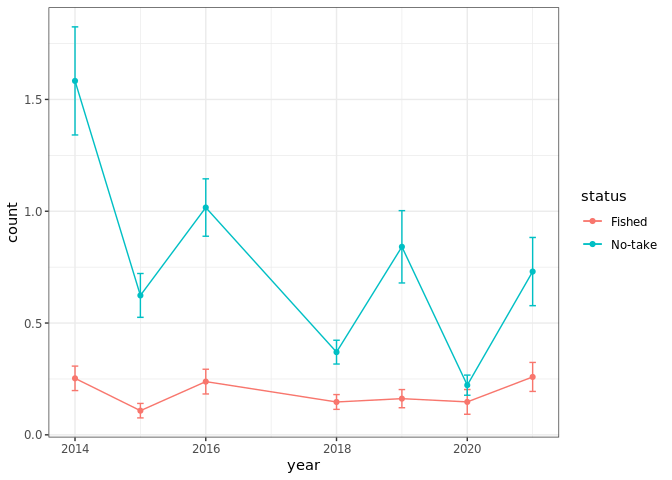<!-- -->

All years - complexity x Sanctuary x
Status

``` r
ggplot(dat%>%filter(size.class=="legal"), aes(x=complexity, y=count,colour=status)) + 
  geom_smooth(method=lm, size=0.5,se=F)+
  theme_bw()+
  facet_grid(sanctuary~.)
```

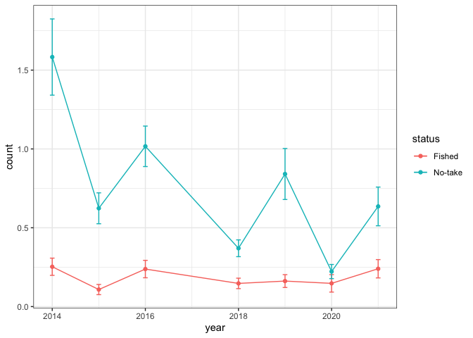<!-- -->

2020 - Sanctuary x
Status

``` r
ggplot(dat%>%filter(size.class=="legal"&year==2020),aes(x=status, y=count,fill=status)) +
    stat_summary(fun.y=mean, geom="bar", colour="black") +
    stat_summary(fun.ymin = se.min, fun.ymax = se.max, geom = "errorbar", width = 0.1) +
    facet_grid(.~sanctuary)
```

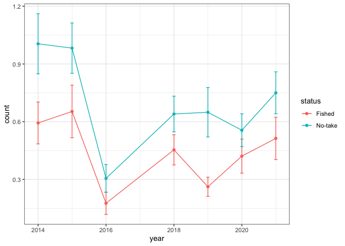<!-- -->

2020 - Complexity x
Status

``` r
 ggplot(dat%>%filter(size.class=="legal"&year==2020), aes(x=complexity, y=count,colour=sanctuary)) + 
    geom_smooth(method=lm, size=0.5,se=F)+
    coord_cartesian(ylim = c(0, 0.5), expand = FALSE)+
  facet_grid(.~status)
```

<!-- -->

2020 - Depth x
Status

``` r
 ggplot(dat%>%filter(size.class=="legal"&year==2020), aes(x=depth, y=count,colour=sanctuary)) + 
    geom_smooth(method=lm, size=0.5,se=F)+
    coord_cartesian(ylim = c(0, 0.5), expand = FALSE)+
  facet_grid(.~status)
```

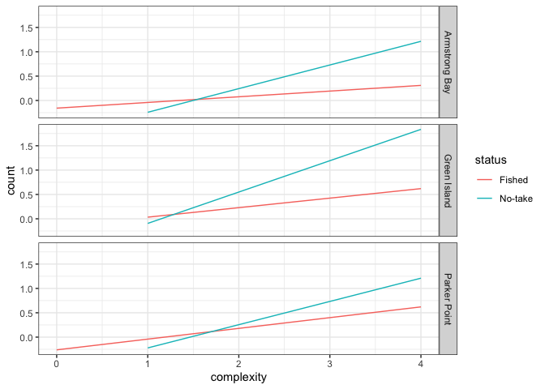<!-- -->

## A note on geom\_smooth()

A word of caution, geom\_smooth() will calculate SE around a fitted
model dependent on the method argument in the function. This SE is based
on model, as specified in the method argument, and is unlikley to be
appropriate for the sampling design or data analysis model you have
used.

In the case of this example lobster density data, the sampling design
involes multiple locations and sites, which may have been analysed with
a nested and/or mixed model. Therefore any SE calcualted by the
geom\_smooth() function will not be correct/appropriate to display.

2019 - Complexity x Sanctuary with an incorrect
SE

``` r
 ggplot(dat%>%filter(size.class=="legal"&year==2019), aes(x=complexity, y=count,colour=sanctuary)) + 
    geom_smooth(method=lm, size=0.5,se=T)+
    coord_cartesian(ylim = c(0, 3), expand = FALSE)+
  ggtitle("incorrect SE")
```

<!-- -->

In this case, the appropriate way to generate a SE would be to model the
data using glmer() or equivalent and then use predict() to predict the
mean and SE of the fitted model.

No one worries about this with most ANOVA analyses :)

Go back to
[Analysis-lobster-density](https://github.com/UWA-BIOL4408-Marine-Ecology/Analysis-lobster-density/blob/master/README.md)

Go forward to
[5\_lobster-density\_format-for-PRIMER](https://github.com/UWA-BIOL4408-Marine-Ecology/Analysis-lobster-density/blob/master/5_lobster-density_format-for-PRIMER.md)

Armstrong - Sanctuary x Status

``` r
glimpse(dat)
```

    ## Observations: 7,032
    ## Variables: 10
    ## $ sample.no  <dbl> 1, 2, 3, 4, 5, 6, 7, 8, 9, 10, 11, 12, 13, 14, 15, 16, 17,…
    ## $ year       <dbl> 2014, 2014, 2014, 2014, 2014, 2014, 2014, 2014, 2014, 2014…
    ## $ date       <dttm> 2014-01-26 16:00:00, 2014-01-26 16:00:00, 2014-01-26 16:0…
    ## $ sanctuary  <chr> "Armstrong Bay", "Armstrong Bay", "Armstrong Bay", "Armstr…
    ## $ status     <chr> "No-take", "No-take", "No-take", "No-take", "No-take", "No…
    ## $ site.new   <chr> "Armstrong Bay.No-take.Little Armstrong", "Armstrong Bay.N…
    ## $ complexity <dbl> 0, 2, 4, 1, 4, 2, 2, 2, 2, 1, 3, 1, 1, 2, 1, 3, 1, 2, 2, 0…
    ## $ depth      <dbl> 0, 0, 0, 0, 0, 0, 0, 0, 0, 0, 0, 0, 0, 0, 0, 0, 0, 0, 0, 0…
    ## $ size.class <chr> "legal", "legal", "legal", "legal", "legal", "legal", "leg…
    ## $ count      <dbl> 0, 0, 0, 0, 0, 0, 0, 0, 0, 0, 0, 0, 1, 0, 0, 0, 0, 0, 0, 0…

``` r
ggplot(dat%>%filter(size.class=="legal"&sanctuary=="Armstrong Bay"),aes(x=year, y=count,colour=status)) +
    stat_summary(fun.y=mean, geom="point", colour="black") +
    stat_summary(fun.ymin = se.min, fun.ymax = se.max, geom = "errorbar", width = 0.1) +
    facet_grid(site.new~.)+
  theme(strip.text.y = element_text(angle=0))
```

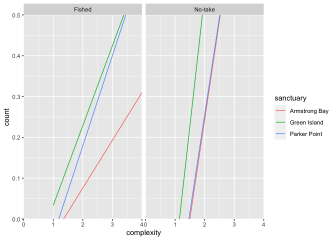<!-- -->

Armstrong - Sanctuary x Status - with data points

``` r
glimpse(dat)
```

    ## Observations: 7,032
    ## Variables: 10
    ## $ sample.no  <dbl> 1, 2, 3, 4, 5, 6, 7, 8, 9, 10, 11, 12, 13, 14, 15, 16, 17,…
    ## $ year       <dbl> 2014, 2014, 2014, 2014, 2014, 2014, 2014, 2014, 2014, 2014…
    ## $ date       <dttm> 2014-01-26 16:00:00, 2014-01-26 16:00:00, 2014-01-26 16:0…
    ## $ sanctuary  <chr> "Armstrong Bay", "Armstrong Bay", "Armstrong Bay", "Armstr…
    ## $ status     <chr> "No-take", "No-take", "No-take", "No-take", "No-take", "No…
    ## $ site.new   <chr> "Armstrong Bay.No-take.Little Armstrong", "Armstrong Bay.N…
    ## $ complexity <dbl> 0, 2, 4, 1, 4, 2, 2, 2, 2, 1, 3, 1, 1, 2, 1, 3, 1, 2, 2, 0…
    ## $ depth      <dbl> 0, 0, 0, 0, 0, 0, 0, 0, 0, 0, 0, 0, 0, 0, 0, 0, 0, 0, 0, 0…
    ## $ size.class <chr> "legal", "legal", "legal", "legal", "legal", "legal", "leg…
    ## $ count      <dbl> 0, 0, 0, 0, 0, 0, 0, 0, 0, 0, 0, 0, 1, 0, 0, 0, 0, 0, 0, 0…

``` r
ggplot(dat%>%filter(size.class=="legal"&sanctuary=="Armstrong Bay"),aes(x=year, y=count,colour=status)) +
    stat_summary(fun.y=mean, geom="point", colour="black") +
    stat_summary(fun.ymin = se.min, fun.ymax = se.max, geom = "errorbar", width = 0.1) +
  geom_jitter(alpha=0.25)+
    facet_grid(site.new~.)+
  theme(strip.text.y = element_text(angle=0))
```

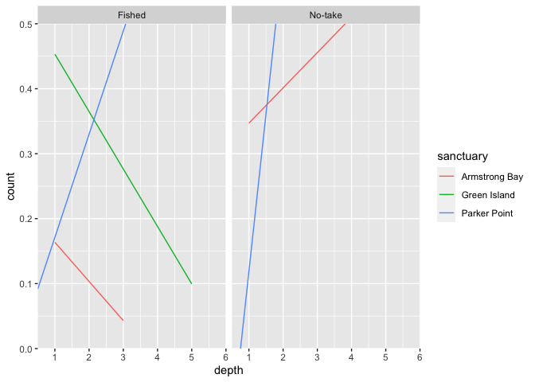<!-- -->

Green - Sanctuary x Status

``` r
glimpse(dat)
```

    ## Observations: 7,032
    ## Variables: 10
    ## $ sample.no  <dbl> 1, 2, 3, 4, 5, 6, 7, 8, 9, 10, 11, 12, 13, 14, 15, 16, 17,…
    ## $ year       <dbl> 2014, 2014, 2014, 2014, 2014, 2014, 2014, 2014, 2014, 2014…
    ## $ date       <dttm> 2014-01-26 16:00:00, 2014-01-26 16:00:00, 2014-01-26 16:0…
    ## $ sanctuary  <chr> "Armstrong Bay", "Armstrong Bay", "Armstrong Bay", "Armstr…
    ## $ status     <chr> "No-take", "No-take", "No-take", "No-take", "No-take", "No…
    ## $ site.new   <chr> "Armstrong Bay.No-take.Little Armstrong", "Armstrong Bay.N…
    ## $ complexity <dbl> 0, 2, 4, 1, 4, 2, 2, 2, 2, 1, 3, 1, 1, 2, 1, 3, 1, 2, 2, 0…
    ## $ depth      <dbl> 0, 0, 0, 0, 0, 0, 0, 0, 0, 0, 0, 0, 0, 0, 0, 0, 0, 0, 0, 0…
    ## $ size.class <chr> "legal", "legal", "legal", "legal", "legal", "legal", "leg…
    ## $ count      <dbl> 0, 0, 0, 0, 0, 0, 0, 0, 0, 0, 0, 0, 1, 0, 0, 0, 0, 0, 0, 0…

``` r
ggplot(dat%>%filter(size.class=="legal"&sanctuary=="Green Island"),aes(x=year, y=count,colour=status)) +
    stat_summary(fun.y=mean, geom="point", colour="black") +
    stat_summary(fun.ymin = se.min, fun.ymax = se.max, geom = "errorbar", width = 0.1) +
    facet_grid(site.new~.)+
  theme(strip.text.y = element_text(angle=0))
```

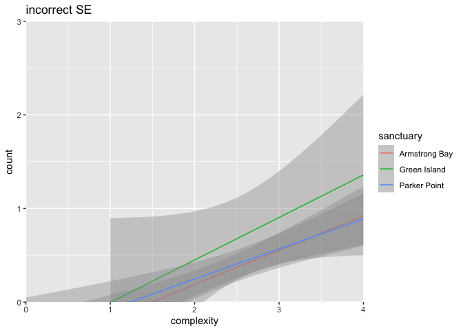<!-- -->

Parker - Sanctuary x Status

``` r
glimpse(dat)
```

    ## Observations: 7,032
    ## Variables: 10
    ## $ sample.no  <dbl> 1, 2, 3, 4, 5, 6, 7, 8, 9, 10, 11, 12, 13, 14, 15, 16, 17,…
    ## $ year       <dbl> 2014, 2014, 2014, 2014, 2014, 2014, 2014, 2014, 2014, 2014…
    ## $ date       <dttm> 2014-01-26 16:00:00, 2014-01-26 16:00:00, 2014-01-26 16:0…
    ## $ sanctuary  <chr> "Armstrong Bay", "Armstrong Bay", "Armstrong Bay", "Armstr…
    ## $ status     <chr> "No-take", "No-take", "No-take", "No-take", "No-take", "No…
    ## $ site.new   <chr> "Armstrong Bay.No-take.Little Armstrong", "Armstrong Bay.N…
    ## $ complexity <dbl> 0, 2, 4, 1, 4, 2, 2, 2, 2, 1, 3, 1, 1, 2, 1, 3, 1, 2, 2, 0…
    ## $ depth      <dbl> 0, 0, 0, 0, 0, 0, 0, 0, 0, 0, 0, 0, 0, 0, 0, 0, 0, 0, 0, 0…
    ## $ size.class <chr> "legal", "legal", "legal", "legal", "legal", "legal", "leg…
    ## $ count      <dbl> 0, 0, 0, 0, 0, 0, 0, 0, 0, 0, 0, 0, 1, 0, 0, 0, 0, 0, 0, 0…

``` r
ggplot(dat%>%filter(size.class=="legal"&sanctuary=="Parker Point"),aes(x=year, y=count,colour=status)) +
    stat_summary(fun.y=mean, geom="point", colour="black") +
    stat_summary(fun.ymin = se.min, fun.ymax = se.max, geom = "errorbar", width = 0.1) +
    facet_grid(site.new~.)+
  theme(strip.text.y = element_text(angle=0))
```

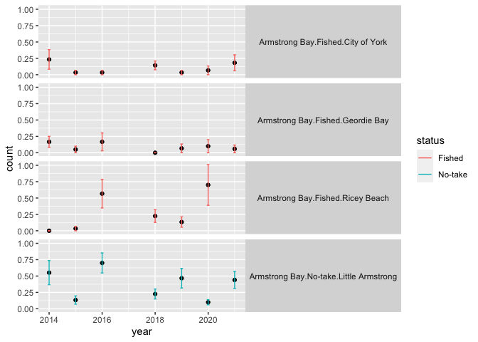<!-- -->

all - Year x Sanctuary with an incorrect
SE

``` r
 ggplot(dat%>%filter(size.class=="legal"), aes(x=year, y=count,colour=status)) + 
    geom_smooth(method=lm, size=0.5,se=T)+
    coord_cartesian(ylim = c(0, 3), expand = FALSE)+
  ggtitle("incorrect SE")
```

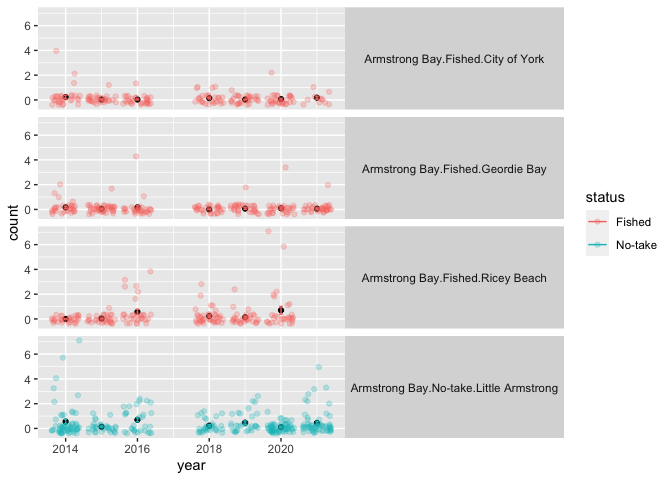<!-- -->
